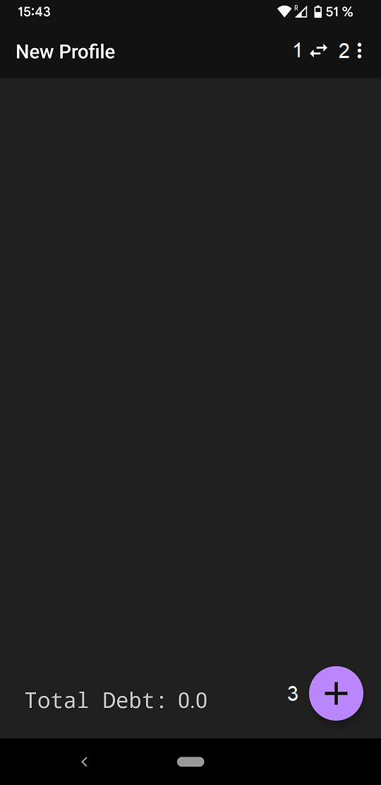
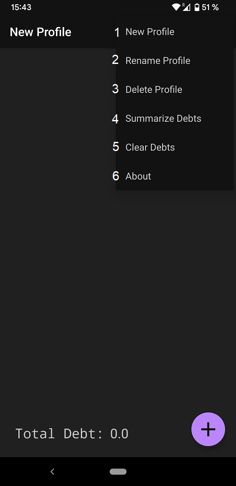
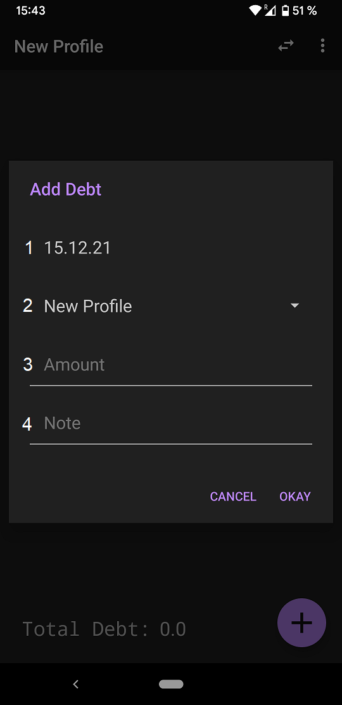
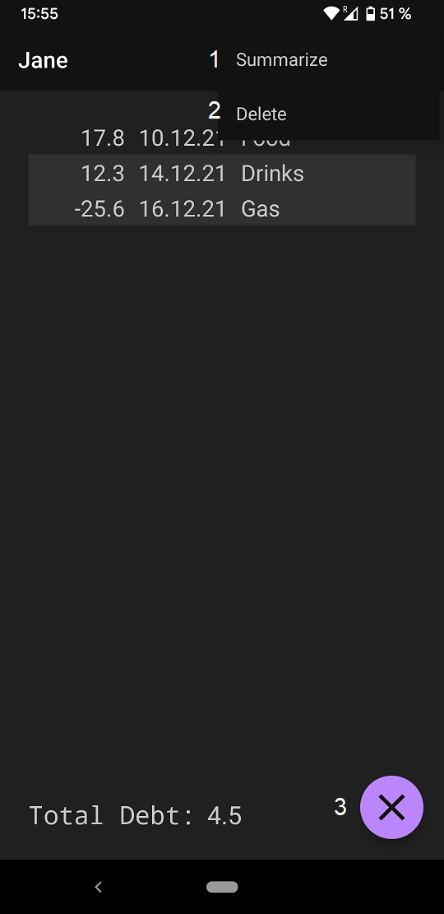

# Friendly Debts

A lightweight Android app to track debts you have with your friends and family.
Do you find yourself doing a lot of purchases together with your friends? Do you haven to use
the phrases "I got it next time" and "I will pay you back next week" regularly but next time 
or week you cannot recall the details? Then this app will help you keep a tab on all the small
favors that tend to accumulate over the lifetime of a friendship.

# Get the app

If you don't want to build this project yourself you can download the released ``APK`` file
and install it directly on your phone.

# How to use

Add a debt with the floating action button.
Hold press on a debt to edit it.
Tap on a debt to select it for extended actions.

## Main screen

1. Open dialog to change profiles.

2. Open rest of the menu.

3. Open dialog to add a new debt.

## Menu

1. Create a new profile.

2. Rename the active profile.

3. Delete the active profile.

4. Summarize all debts of the active profile into a single debt.

5. Clear all debts from the active profile.

6. Open about dialog.

## Add debt dialog

1. Select date.

2. Select profile.

3. Enter amount, must be a number.

4. Enter a note.

## Select debts

1. Summarize the selected debts into a single one.

2. Delete the selected debts from the list.

3. Exit selection mode.
